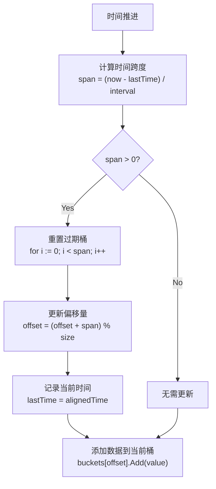

# 滑动窗口 (Rolling Window)

滑动窗口是一种基于时间的数据统计工具，广泛应用于监控、限流、熔断等场景。本实现采用固定大小的循环缓冲区设计，提供高效的时间窗口数据统计功能。

## 📊 实现原理

### 基本概念

滑动窗口将连续的时间分割成固定大小的时间片，每个时间片对应一个**桶（Bucket）**：

```text
时间轴: |-----|-----|-----|-----|-----|
桶编号:   0     1     2     3     4
       [  10 ][  25 ][  18 ][  33 ][  12 ]
        count  count  count  count  count
```

### 循环缓冲区机制

使用固定大小的数组存储桶，通过索引偏移实现时间窗口的滑动：

```text
初始状态 (t=0):
┌─────┬─────┬─────┬─────┬─────┐
│  0  │  1  │  2  │  3  │  4  │ <- 桶编号
├─────┼─────┼─────┼─────┼─────┤
│ B0  │ B1  │ B2  │ B3  │ B4  │ <- 桶对象
└─────┴─────┴─────┴─────┴─────┘
  ↑
offset=0 (当前桶)

时间推进 (t=3):
┌─────┬─────┬─────┬─────┬─────┐
│  0  │  1  │  2  │  3  │  4  │
├─────┼─────┼─────┼─────┼─────┤
│ B0  │ B1  │ B2  │ B3  │ B4  │
└─────┴─────┴─────┴─────┴─────┘
                    ↑
                offset=3 (当前桶)

时间继续推进 (t=6):
┌─────┬─────┬─────┬─────┬─────┐
│  0  │  1  │  2  │  3  │  4  │
├─────┼─────┼─────┼─────┼─────┤
│ B0  │ B1  │ B2  │ B3  │ B4  │ <- B0,B1 被重置
└─────┴─────┴─────┴─────┴─────┘
  ↑
offset=1 (循环回到开头)
```

### 过期桶处理

当时间推进时，自动重置过期的桶：

1. **计算时间跨度**: `span = (now - lastTime) / interval`
2. **重置过期桶**: 从当前位置开始，重置 `span` 个桶
3. **更新偏移量**: `offset = (offset + span) % size`

## 🚀 快速开始

### 基本用法

```go
package main

import (
    "fmt"
    "time"
    "github.com/miebyte/breaker/collection"
)

func main() {
    // 创建一个 10 秒窗口，分成 10 个桶，每个桶 1 秒
    rw := collection.NewRollingWindow[int64, *collection.Bucket[int64]](
        func() *collection.Bucket[int64] {
            return &collection.Bucket[int64]{}
        },
        10,           // 桶数量
        time.Second,  // 时间间隔
    )
    
    // 添加数据
    rw.Add(100)
    rw.Add(200)
    
    // 统计数据
    var totalSum int64
    var totalCount int64
    
    rw.Reduce(func(b *collection.Bucket[int64]) {
        totalSum += b.Sum
        totalCount += b.Count
    })
    
    fmt.Printf("总和: %d, 数量: %d, 平均值: %.2f\n", 
        totalSum, totalCount, float64(totalSum)/float64(totalCount))
}
```

### 高级配置

```go
// 忽略当前桶（避免部分数据影响统计结果）
rw := collection.NewRollingWindow[float64, *collection.Bucket[float64]](
    func() *collection.Bucket[float64] {
        return &collection.Bucket[float64]{}
    },
    20,                    // 20 个桶
    time.Millisecond*500,  // 每个桶 500ms
    collection.IgnoreCurrentBucket[float64, *collection.Bucket[float64]](),
)
```

## 🔧 自定义桶类型

实现 `BucketInterface` 接口来创建自定义桶：

```go
// 统计最大值和最小值的桶
type MinMaxBucket struct {
    min   float64
    max   float64
    count int64
}

func (b *MinMaxBucket) Add(v float64) {
    if b.count == 0 {
        b.min = v
        b.max = v
    } else {
        if v < b.min {
            b.min = v
        }
        if v > b.max {
            b.max = v
        }
    }
    b.count++
}

func (b *MinMaxBucket) Reset() {
    b.min = 0
    b.max = 0
    b.count = 0
}

// 使用自定义桶
rw := collection.NewRollingWindow[float64, *MinMaxBucket](
    func() *MinMaxBucket {
        return &MinMaxBucket{}
    },
    10,
    time.Second,
)
```

## 🔍 API 文档

### 类型定义

```go
// 桶接口
type BucketInterface[T Numerical] interface {
    Add(v T)    // 添加数值
    Reset()     // 重置桶
}

// 滑动窗口
type RollingWindow[T Numerical, B BucketInterface[T]] struct {
    // 内部字段...
}

// 配置选项
type RollingWindowOption[T Numerical, B BucketInterface[T]] func(*RollingWindow[T, B])
```

### 主要方法

#### NewRollingWindow

```go
func NewRollingWindow[T Numerical, B BucketInterface[T]](
    newBucket func() B,           // 桶构造函数
    size int,                     // 桶数量
    interval time.Duration,       // 时间间隔
    opts ...RollingWindowOption[T, B], // 可选配置
) *RollingWindow[T, B]
```

创建新的滑动窗口实例。

**参数:**

- `newBucket`: 桶的构造函数
- `size`: 桶的数量，必须大于 0
- `interval`: 每个桶代表的时间间隔
- `opts`: 可选配置项

#### Add

```go
func (rw *RollingWindow[T, B]) Add(v T)
```

向当前桶添加数值。线程安全。

#### Reduce

```go
func (rw *RollingWindow[T, B]) Reduce(fn func(b B))
```

对所有有效桶执行聚合操作。线程安全。

### 配置选项

#### IgnoreCurrentBucket

```go
func IgnoreCurrentBucket[T Numerical, B BucketInterface[T]]() RollingWindowOption[T, B]
```

配置 `Reduce` 操作时忽略当前桶，避免部分数据影响统计结果。

## ⚡ 性能特性

- **时间复杂度**:
  - Add 操作: O(k)，k 为需要重置的过期桶数量
  - Reduce 操作: O(n)，n 为有效桶数量

- **空间复杂度**: O(size)，size 为配置的桶数量

- **并发安全**: 使用读写锁，支持多读单写

- **内存效率**: 固定大小数组，无额外内存分配

## 🔧 最佳实践

1. **合理设置桶大小**: 窗口大小 = 桶数量 × 时间间隔
2. **选择合适的时间间隔**: 太小会增加开销，太大会降低精度
3. **使用 IgnoreCurrentBucket**: 在需要精确统计时忽略当前未完成的桶
4. **自定义桶类型**: 根据业务需求实现特定的统计逻辑
5. **避免频繁创建**: 滑动窗口实例可以复用

## 🧪 完整示例：QPS 监控

下面是一个完整的示例，展示滑动窗口在 QPS 监控中的应用：

```go
package main

import (
    "fmt"
    "time"
    "github.com/miebyte/breaker/collection"
)

func main() {
    // 创建 5 秒窗口，每秒一个桶
    rw := collection.NewRollingWindow[int64, *collection.Bucket[int64]](
        func() *collection.Bucket[int64] {
            return &collection.Bucket[int64]{}
        },
        5,            // 5 个桶
        time.Second,  // 1 秒间隔
    )
    
    // 模拟请求
    for i := 0; i < 15; i++ {
        // 每 200ms 发送一次请求
        time.Sleep(200 * time.Millisecond)
        rw.Add(1)
        
        // 计算当前 QPS
        var total int64
        rw.Reduce(func(b *collection.Bucket[int64]) {
            total += b.Count
        })
        
        fmt.Printf("时间 %2ds: 当前 QPS = %d\n", i/5, total)
    }
}
```

**输出示例:**

```
时间  0s: 当前 QPS = 1
时间  0s: 当前 QPS = 2
时间  1s: 当前 QPS = 3
时间  1s: 当前 QPS = 4
时间  1s: 当前 QPS = 5
时间  2s: 当前 QPS = 5  <- 窗口已满，开始滑动
时间  2s: 当前 QPS = 5
时间  2s: 当前 QPS = 5
...
```

## 💡 核心算法流程

滑动窗口的数据更新流程如图所示：



## 📚 相关概念

- **固定窗口 vs 滑动窗口**: 固定窗口有边界效应，滑动窗口更平滑
- **时间对齐**: 避免系统时间跳变对统计的影响  
- **桶过期策略**: 自动重置过期桶，保持窗口大小固定
- **循环缓冲区**: 固定大小数组，通过索引偏移实现滑动效果
